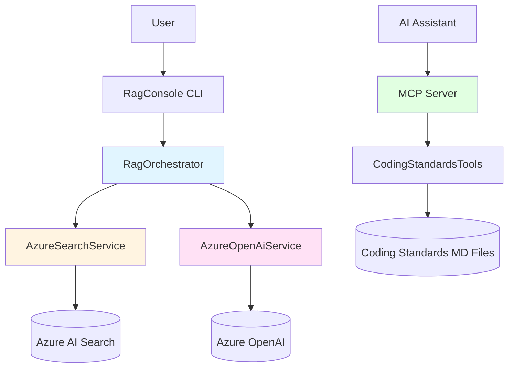
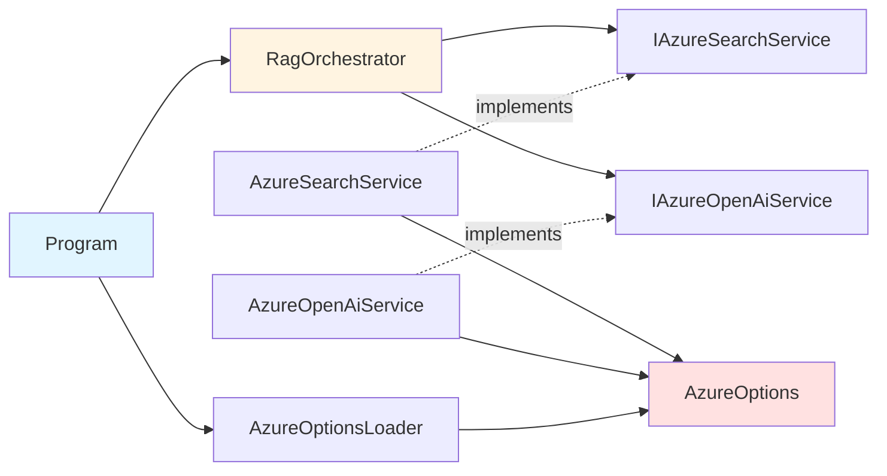

# System Architecture

The Real Madrid RAG system implements a classic Retrieval-Augmented Generation pipeline using Azure services and .NET 8. This page provides a detailed technical overview of the system architecture, data flow, and key components.

## High-Level Architecture



## Core Components

### 1. RagOrchestrator

The orchestrator coordinates the entire RAG pipeline, managing the flow from question to answer.

**Location**: `Orchestration/RagOrchestrator.cs:7-27`

```csharp
public sealed class RagOrchestrator
{
    private readonly IAzureSearchService azureSearchService;
    private readonly IAzureOpenAiService azureOpenAiService;
    private readonly AzureOptions options;

    public async Task<RagResponse> AskAsync(
        string question, 
        CancellationToken cancellationToken = default)
    {
        // 1. Retrieve relevant documents
        var sources = await azureSearchService.SearchAsync(
            question, cancellationToken);
        
        // 2. Generate answer with context
        var answer = await azureOpenAiService.GenerateAnswerAsync(
            question, sources, options.SystemPrompt, cancellationToken);
        
        // 3. Return structured response
        return new RagResponse(answer, sources);
    }
}
```

**Responsibilities**:
- Orchestrates the two-phase RAG pipeline
- Passes retrieved context to the generation service
- Returns structured responses with source attribution

### 2. AzureSearchService

Handles document retrieval from Azure AI Search using semantic search.

**Location**: `Services/AzureSearchService.cs:9-67`

**Key Implementation Details**:

```csharp
public async Task<IReadOnlyList<RagSource>> SearchAsync(
    string question, 
    CancellationToken cancellationToken = default)
{
    var searchOptions = new SearchOptions
    {
        Size = options.AzureAISearch.Top  // Default: 5 documents
    };

    var response = await searchClient.SearchAsync<SearchDocument>(
        question, searchOptions, cancellationToken);
    
    var results = new List<RagSource>();
    await foreach (var item in response.Value.GetResultsAsync())
    {
        // Flexible field mapping for different index schemas
        var id = GetFirstString(item.Document, "id", "chunk_id", "key") 
            ?? Guid.NewGuid().ToString("N");
        var content = GetFirstString(item.Document, "content", "chunk", "text") 
            ?? string.Empty;
        var source = GetFirstString(item.Document, "source", "title", "file") 
            ?? "desconocido";
        var score = item.Score ?? 0d;

        if (!string.IsNullOrWhiteSpace(content))
        {
            results.Add(new RagSource(id, source, content, score));
        }
    }

    return results;
}
```

**Features**:
- **Flexible schema mapping**: Tries multiple field names (`content`, `chunk`, `text`) to support different index structures
- **Relevance scoring**: Returns search scores for transparency
- **Configurable retrieval**: `Top` parameter controls number of documents (default: 5)
- **Empty handling**: Filters out documents with empty content

<Info>
  The `GetFirstString()` helper method at line 49-66 enables compatibility with various Azure AI Search index schemas without code changes.
</Info>

### 3. AzureOpenAiService

Generates natural language answers using Azure OpenAI's chat completion API.

**Location**: `Services/AzureOpenAiService.cs:8-137`

**Request Construction**:

```csharp
public async Task<string> GenerateAnswerAsync(
    string question,
    IReadOnlyList<RagSource> sources,
    string systemPrompt,
    CancellationToken cancellationToken = default)
{
    // Build API endpoint
    var url = $"{endpoint}/openai/deployments/{deployment}/chat/completions?api-version={apiVersion}";
    
    // Construct prompt with context
    var prompt = BuildPrompt(question, sources);
    
    // Create chat messages
    var payload = new
    {
        messages = new object[]
        {
            new { role = "system", content = systemPrompt },
            new { role = "user", content = prompt }
        },
        temperature = options.AzureOpenAI.Temperature,  // Default: 0.1
        max_tokens = options.AzureOpenAI.MaxTokens      // Default: 800
    };
    
    // Send HTTP request with api-key header
    using var request = new HttpRequestMessage(HttpMethod.Post, url)
    {
        Content = new StringContent(
            JsonSerializer.Serialize(payload), 
            Encoding.UTF8, 
            "application/json")
    };
    request.Headers.Add("api-key", options.AzureOpenAI.ApiKey);
    
    // Parse and extract answer
    var response = await httpClient.SendAsync(request, cancellationToken);
    var responseBody = await response.Content.ReadAsStringAsync(cancellationToken);
    
    using var json = JsonDocument.Parse(responseBody);
    return ExtractAnswer(json.RootElement);
}
```

**Prompt Engineering** (`BuildPrompt` method at lines 66-92):

```csharp
private static string BuildPrompt(string question, IReadOnlyList<RagSource> sources)
{
    var builder = new StringBuilder();
    builder.AppendLine("Pregunta del usuario:");
    builder.AppendLine(question);
    builder.AppendLine();
    builder.AppendLine("Contexto recuperado:");

    if (sources.Count == 0)
    {
        builder.AppendLine("- No se recuperó contexto relevante del índice.");
        builder.AppendLine();
        builder.AppendLine("Si no hay contexto suficiente, indícalo explícitamente.");
        return builder.ToString();
    }

    for (var index = 0; index < sources.Count; index++)
    {
        var source = sources[index];
        builder.AppendLine($"[{index + 1}] Fuente: {source.Source}");
        builder.AppendLine(source.Content);
        builder.AppendLine();
    }

    builder.AppendLine("Responde usando solo la información del contexto.");
    return builder.ToString();
}
```

**Model Parameters**:
- `temperature`: 0.1 (low randomness for factual responses)
- `max_tokens`: 800 (concise answers)
- `api-version`: 2024-10-21

<Warning>
  The service uses direct HTTP calls instead of the Azure OpenAI SDK to have full control over request/response handling and error messages.
</Warning>

### 4. Configuration System

Hierarchical configuration loading with environment variable override.

**Location**: `Config/AzureOptionsLoader.cs:7-97`

**Loading Priority** (highest to lowest):

1. **Environment variables** (e.g., `AZURE_OPENAI_ENDPOINT`)
2. **appsettings.json** in current directory
3. **appsettings.json** in base directory
4. **appsettings.json** in parent project directory

```csharp
public static AzureOptions Load()
{
    var options = LoadFromFile() ?? new AzureOptions();

    // Environment variables override file settings
    var openAiEndpoint = GetEnv("AZURE_OPENAI_ENDPOINT");
    var openAiApiKey = GetEnv("AZURE_OPENAI_API_KEY");
    // ... more environment variables

    return new AzureOptions
    {
        SystemPrompt = GetEnv("RAG_SYSTEM_PROMPT") ?? options.SystemPrompt,
        AzureOpenAI = new AzureOpenAiOptions
        {
            Endpoint = openAiEndpoint ?? options.AzureOpenAI.Endpoint,
            ApiKey = openAiApiKey ?? options.AzureOpenAI.ApiKey,
            // ...
        },
        // ...
    };
}
```

**Validation** (`Config/AzureOptions.cs:9-44`):

```csharp
public List<string> Validate()
{
    var errors = new List<string>();

    if (IsMissing(AzureOpenAI.Endpoint))
        errors.Add("AzureOpenAI.Endpoint es requerido.");
    
    if (IsMissing(AzureOpenAI.ApiKey))
        errors.Add("AzureOpenAI.ApiKey es requerido.");
    
    // ... more validations

    return errors;
}

private static bool IsMissing(string? value)
{
    // Treats placeholders like "<tu-openai>" as missing
    return string.IsNullOrWhiteSpace(value) 
        || value.Contains("<") 
        || value.Contains(">");
}
```

### 5. MCP Server

Provides coding standards to AI assistants through the Model Context Protocol.

**Location**: `RealMadrid.MCPServer/Program.cs:5-18`

```csharp
var builder = WebApplication.CreateBuilder(args);

builder.WebHost.UseUrls(
    Environment.GetEnvironmentVariable("ASPNETCORE_URLS") ?? "http://+:8080");

builder.Services
    .AddMcpServer()
    .WithHttpServerTransport()
    .WithToolsFromAssembly();  // Auto-discovers [McpServerTool] methods

var app = builder.Build();
app.MapMcp();
await app.RunAsync();
```

**Available Tools** (`CodingStandardsTools.cs:6-99`):

<CodeGroup>

```csharp GetCodingStandard
[McpServerTool]
[Description("Gets coding standard by topic. Topics: architecture, naming-conventions, error-handling, api-design.")]
public static async Task<string> GetCodingStandard(
    [Description("Standard topic name")] string topic)
{
    if (!TopicToFile.TryGetValue(topic.Trim(), out var fileName))
        return $"Topic '{topic}' not found. Available: {string.Join(", ", TopicToFile.Keys)}.";
    
    var filePath = Path.Combine(StandardsBasePath, fileName);
    return await File.ReadAllTextAsync(filePath);
}
```

```csharp ListAvailableStandards
[McpServerTool]
[Description("Lists all available coding standards. Call first if unsure which to fetch.")]
public static Task<string[]> ListAvailableStandards()
{
    var standards = Directory
        .EnumerateFiles(StandardsBasePath, "*.md", SearchOption.TopDirectoryOnly)
        .Select(path => Path.GetFileNameWithoutExtension(path)!)
        .OrderBy(name => name)
        .ToArray();
    
    return Task.FromResult(standards);
}
```

```csharp SearchInStandards
[McpServerTool]
[Description("Searches all standards for a keyword. Use for concepts like logging, async.")]
public static async Task<string> SearchInStandards(
    [Description("Keyword to search in standards")] string keyword)
{
    var files = Directory.EnumerateFiles(StandardsBasePath, "*.md");
    var matchesByFile = new List<string>();
    
    foreach (var file in files)
    {
        var lines = await File.ReadAllLinesAsync(file);
        var matchedLines = lines
            .Select((line, index) => new { line, index })
            .Where(x => x.line.Contains(keyword, StringComparison.OrdinalIgnoreCase))
            .Select(x => $"L{x.index + 1}: {x.line.Trim()}")
            .ToList();
        
        if (matchedLines.Count > 0)
        {
            var fileName = Path.GetFileNameWithoutExtension(file);
            matchesByFile.Add($"{fileName}\n{string.Join(Environment.NewLine, matchedLines)}");
        }
    }
    
    return matchesByFile.Count == 0
        ? $"No matches found for '{keyword}'."
        : string.Join("\n\n", matchesByFile);
}
```

</CodeGroup>

## Data Flow

### RAG Pipeline Execution

<Steps>
  <Step title="User submits question">
    The question is received by `Program.cs:38` and passed to `RagOrchestrator.AskAsync()`
  </Step>
  
  <Step title="Document retrieval">
    `AzureSearchService.SearchAsync()` queries Azure AI Search:
    
    - Constructs `SearchOptions` with `Size = Top` (default 5)
    - Executes semantic search against the index
    - Maps document fields to `RagSource` objects
    - Returns scored results ordered by relevance
    
    **Output shape**:
    ```csharp
    IReadOnlyList<RagSource> {
        Id: "abc123",
        Source: "Historia del Real Madrid",
        Content: "El Real Madrid se fundó el 6 de marzo de 1902...",
        Score: 0.892
    }
    ```
  </Step>
  
  <Step title="Prompt construction">
    `AzureOpenAiService.BuildPrompt()` creates the user message:
    
    ```
    Pregunta del usuario:
    ¿Cuándo se fundó el Real Madrid?
    
    Contexto recuperado:
    [1] Fuente: Historia del Real Madrid
    El Real Madrid se fundó el 6 de marzo de 1902...
    
    [2] Fuente: Fundación y primeros años
    En 1902, un grupo de aficionados...
    
    Responde usando solo la información del contexto.
    ```
  </Step>
  
  <Step title="Answer generation">
    `AzureOpenAiService.GenerateAnswerAsync()` calls Azure OpenAI:
    
    - Sends system prompt + user prompt to chat completion API
    - Uses `temperature=0.1` for deterministic responses
    - Limits response to `max_tokens=800`
    - Extracts text from JSON response at `choices[0].message.content`
    
    **API request payload**:
    ```json
    {
      "messages": [
        {
          "role": "system",
          "content": "Eres un asistente experto de Real Madrid..."
        },
        {
          "role": "user",
          "content": "Pregunta del usuario:\n..."
        }
      ],
      "temperature": 0.1,
      "max_tokens": 800
    }
    ```
  </Step>
  
  <Step title="Response assembly">
    `RagOrchestrator` combines the answer with source metadata:
    
    ```csharp
    return new RagResponse(
        Answer: "El Real Madrid se fundó el 6 de marzo de 1902...",
        Sources: [
            { Id: "...", Source: "Historia del Real Madrid", Score: 0.892 },
            { Id: "...", Source: "Fundación y primeros años", Score: 0.756 }
        ]
    );
    ```
  </Step>
  
  <Step title="Display results">
    `Program.cs:39-48` outputs the answer and sources to the console
  </Step>
</Steps>

## Component Dependencies



**Package Dependencies** (from `RagConsole.csproj:10-16`):

| Package | Version | Purpose |
|---------|---------|----------|
| Azure.AI.OpenAI | 2.1.0 | (Not directly used, but available for SDK-based calls) |
| Azure.Identity | 1.18.0 | Azure authentication support |
| Azure.Search.Documents | 11.7.0 | Azure AI Search SDK |
| Microsoft.Extensions.Hosting | 10.0.3 | Dependency injection and hosting |
| Microsoft.Extensions.Logging.Console | 10.0.3 | Logging infrastructure |

## Error Handling

### Configuration Validation

```csharp
// Program.cs:5-16
var options = AzureOptionsLoader.Load();
var validationErrors = options.Validate();

if (validationErrors.Count > 0)
{
    Console.WriteLine("Configuración incompleta. Revisa appsettings.json o variables de entorno:");
    foreach (var error in validationErrors)
    {
        Console.WriteLine($"- {error}");
    }
    return;  // Exit without running
}
```

### Runtime Exception Handling

```csharp
// Program.cs:36-54
try
{
    var response = await orchestrator.AskAsync(question);
    Console.WriteLine("\nRespuesta:");
    Console.WriteLine(response.Answer);
    // ... display sources
}
catch (Exception exception)
{
    Console.WriteLine($"Error ejecutando RAG: {exception.Message}");
}
```

### Azure OpenAI Error Responses

```csharp
// Services/AzureOpenAiService.cs:50-53
if (!response.IsSuccessStatusCode)
{
    throw new InvalidOperationException(
        $"Azure OpenAI devolvió {(int)response.StatusCode}: {responseBody}");
}
```

<Note>
  The system includes detailed error messages with HTTP status codes and response bodies to aid debugging Azure service issues.
</Note>

## Performance Characteristics

### Latency Breakdown

| Phase | Typical Duration | Influenced By |
|-------|------------------|---------------|
| Search retrieval | 100-300ms | Index size, query complexity, `Top` parameter |
| Prompt construction | Less than 10ms | Number of sources, source length |
| LLM generation | 1-3 seconds | max_tokens, model type, Azure region |
| **Total** | **1.5-4 seconds** | Combined factors |

### Token Usage

Approximate token consumption per query:

- **System prompt**: ~30 tokens
- **User question**: 5-50 tokens
- **Context per source**: 200-500 tokens
- **Total input** (5 sources): ~1,500-2,500 tokens
- **Generated output**: Up to 800 tokens (configurable via `MaxTokens`)

<Info>
  Reduce costs by:
  - Lowering `AzureAISearch.Top` (fewer sources)
  - Reducing `AzureOpenAI.MaxTokens` (shorter answers)
  - Using GPT-3.5-turbo instead of GPT-4
</Info>

### Scalability

**Current Design**: Synchronous, single-threaded console application

**Limitations**:
- Processes one question at a time
- No built-in caching
- Stateless (doesn't maintain conversation history)

**Extension Points**:
- Replace `HttpClient` with `IHttpClientFactory` for connection pooling
- Add response caching layer (Redis, in-memory)
- Implement conversation history using Azure Cosmos DB
- Deploy as Azure Functions or Container Apps for horizontal scaling

## Security Considerations

<Warning>
  **API Key Management**: Never commit `appsettings.json` with real credentials. Use Azure Key Vault or environment variables in production.
</Warning>

### Authentication

Currently uses **API key authentication**:

```csharp
// Search: AzureSearchService.cs:17-20
searchClient = new SearchClient(
    new Uri(options.AzureAISearch.Endpoint),
    options.AzureAISearch.IndexName,
    new AzureKeyCredential(options.AzureAISearch.ApiKey));

// OpenAI: AzureOpenAiService.cs:45
request.Headers.Add("api-key", options.AzureOpenAI.ApiKey);
```

**Recommended for Production**: Migrate to **Managed Identity** using `Azure.Identity`:

```csharp
using Azure.Identity;

searchClient = new SearchClient(
    new Uri(options.AzureAISearch.Endpoint),
    options.AzureAISearch.IndexName,
    new DefaultAzureCredential());
```

### Input Sanitization

- User questions are passed directly to Azure services (no local SQL/command execution)
- Azure AI Search handles query escaping automatically
- No risk of prompt injection affecting system operation (only response quality)

## Extension: MCP Server Architecture

The MCP server is a separate ASP.NET Core application:

```csharp
// RealMadrid.MCPServer/Program.cs:9-12
builder.Services
    .AddMcpServer()                    // Register MCP services
    .WithHttpServerTransport()         // HTTP transport layer
    .WithToolsFromAssembly();          // Auto-discover tools
```

**Tool Discovery**: The `[McpServerTool]` attribute marks methods for automatic registration:

```csharp
[McpServerTool]
[Description("Gets coding standard by topic...")]
public static async Task<string> GetCodingStandard(string topic) { ... }
```

**File Management** (`RealMadrid.MCPServer.csproj:20-24`):

```xml
<ItemGroup>
  <Content Include="..\..\coding-standards\**\*.md" LinkBase="coding-standards">
    <CopyToOutputDirectory>PreserveNewest</CopyToOutputDirectory>
  </Content>
</ItemGroup>
```

Copies all Markdown files from `coding-standards/` to the output directory, making them accessible to the MCP tools.

## Design Patterns

### Dependency Injection

```csharp
// Program.cs:20-22
var searchService = new AzureSearchService(options);
var openAiService = new AzureOpenAiService(httpClient, options);
var orchestrator = new RagOrchestrator(searchService, openAiService);
```

Manual dependency injection with interface-based design (`IAzureSearchService`, `IAzureOpenAiService`) enables testing and swapping implementations.

### Repository Pattern

`AzureSearchService` abstracts the search infrastructure:

```csharp
public interface IAzureSearchService
{
    Task<IReadOnlyList<RagSource>> SearchAsync(
        string question, 
        CancellationToken cancellationToken = default);
}
```

Allows replacing Azure AI Search with Elasticsearch, PostgreSQL pgvector, etc., without changing orchestrator code.

### Builder Pattern

Prompt construction uses StringBuilder for efficient string concatenation:

```csharp
// Services/AzureOpenAiService.cs:68-91
var builder = new StringBuilder();
builder.AppendLine("Pregunta del usuario:");
builder.AppendLine(question);
// ...
return builder.ToString();
```

## Next Steps

<CardGroup cols={2}>
  <Card title="Quickstart" icon="rocket" href="/quickstart">
    Run the system and start asking questions
  </Card>
  <Card title="Introduction" icon="book" href="/introduction">
    Learn about RAG and system capabilities
  </Card>
</CardGroup>